# ListMe

> **Organiza cualquier cosa que quieras recordar, coleccionar o seguir** — en un solo lugar, desde cualquier dispositivo.

ListMe es una aplicación multiplataforma (Android, Web, Windows) construida con Flutter que permite crear listas de cualquier tipo: películas pendientes, restaurantes visitados, libros leídos, ideas de tatuajes, lugares que visitar, videojuegos completados o cualquier colección que se te ocurra. Los usuarios pueden añadir ítems de forma manual o importarlos desde APIs externas (TMDb, OMDb, Google Books, MAL/Jikan), personalizar cada ítem con atributos propios y compartir sus listas con otros usuarios mediante invitaciones.

---

## Características principales

- **Listas para todo** — crea listas de cualquier tipo: media, lugares, ideas, colecciones físicas o lo que necesites
- **Importación desde APIs** — busca y añade contenido directamente desde TMDb, OMDb, Google Books y MyAnimeList (Jikan)
- **Atributos dinámicos** — cada ítem puede tener atributos personalizados (puntuación, estado, fecha, notas, precio…)
- **Galería de imágenes** — sube fotos a cada ítem y elige una imagen favorita como miniatura
- **Listas compartidas** — invita a otros usuarios a colaborar en tus listas
- **Búsqueda y filtros** — filtra por nombre, categoría, estado y más
- **Soporte multiidioma** — español e inglés incluidos
- **Temas y personalización** — modo claro/oscuro, colores de acento, escala de fuente
- **Claves API configurables** — introduce tus propias claves de TMDb, OMDb y Google Books desde los ajustes

---

## Casos de uso de ejemplo

| Lista | Qué guardar en cada ítem |
|-------|--------------------------|
| Películas pendientes | Título, género, plataforma, puntuación |
| Restaurantes visitados | Nombre, ciudad, tipo de cocina, valoración |
| Ideas de tatuajes | Descripción, estilo, artista de referencia, foto |
| Libros leídos | Título, autor, fecha de lectura, reseña |
| Lugares que visitar | Nombre, país, foto, estado (pendiente / visitado) |
| Videojuegos completados | Título, horas jugadas, puntuación, plataforma |

---

## Capturas de pantalla

| Inicio | Detalle | Búsqueda | Ajustes |
|:------:|:-------:|:--------:|:-------:|
| *(próximamente)* | *(próximamente)* | *(próximamente)* | *(próximamente)* |

---

## Tecnologías

| Capa | Tecnología |
|------|-----------|
| Frontend | Flutter 3 · Dart · Provider |
| Autenticación | JWT (gestionado por el backend) |
| Almacenamiento de imágenes | Firebase Storage |
| Backend | Spring Boot 3 · Java 21 |
| Base de datos | PostgreSQL |
| Cache local | Hive |
| Preferencias | SharedPreferences |
| Redes | Dio · http |
| CI/CD | GitHub Actions |
| Despliegue | Docker Compose en NAS (Cloudflare Tunnel) |

---

## Requisitos previos

- [Flutter SDK](https://flutter.dev/docs/get-started/install) ≥ 3.11
- Dart SDK ≥ 3.11
- Un proyecto Firebase con **Authentication** y **Storage** habilitados
- Backend ListMe en ejecución (ver [API_Listme](https://github.com/Angelery33/API_Listme))

---

## Configuración

### 1. Clonar el repositorio

```bash
git clone https://github.com/Angelery33/ListMe_Flutter.git
cd ListMe_Flutter
flutter pub get
```

### 2. Configurar Firebase

Descarga el archivo de configuración correspondiente a tu plataforma desde la consola de Firebase y colócalo en su ubicación:

| Plataforma | Archivo | Destino |
|-----------|---------|---------|
| Android | `google-services.json` | `android/app/` |
| iOS | `GoogleService-Info.plist` | `ios/Runner/` |
| Web | `firebase_options.dart` | `lib/` |
| Windows | `google-services.json` | `windows/` |

### 3. Configurar la URL de la API

En [lib/core/constants/api_constants.dart](lib/core/constants/api_constants.dart) ajusta la URL base del backend:

```dart
static const String baseUrl = 'https://tu-dominio.com/api';
```

### 4. Claves API externas (opcional)

Las claves de TMDb, OMDb y Google Books se pueden introducir desde **Ajustes → Claves API** dentro de la propia app. Si no introduces ninguna, se usa la clave por defecto del proyecto.

---

## Compilar y ejecutar

### Android

```bash
flutter build apk --release
# o instalar directamente en un dispositivo conectado:
flutter run --release
```

### Web

```bash
flutter build web --release
# El output queda en build/web/
```

### Windows

```bash
flutter build windows --release
# El ejecutable queda en build/windows/x64/runner/Release/
```

---

## Estructura del proyecto

```
lib/
├── core/
│   ├── constants/       # URLs, colores, constantes globales
│   ├── models/          # Modelos de datos (Item, List, User…)
│   ├── services/        # Servicios: API cliente, Firebase, APIs externas
│   └── utils/           # Helpers y utilidades
├── data/
│   └── items/           # Repositorios de datos
├── providers/           # Estado global (Provider / ChangeNotifier)
│   ├── auth/
│   ├── items/
│   ├── lists/
│   └── settings/
├── screens/             # Pantallas de la aplicación
│   ├── auth/
│   ├── items/
│   ├── lists/
│   ├── profile/
│   ├── settings/
│   └── social/
├── widgets/             # Widgets reutilizables
│   ├── items/
│   ├── lists/
│   └── shared/
└── main.dart
```

---

## Despliegue web (GitHub Actions)

El repositorio incluye un workflow que, en cada push a `main`, compila la versión web y la despliega en el NAS mediante SCP a través del túnel Cloudflare:

```
.github/workflows/deploy.yml
```

Los secretos necesarios en GitHub (`SSH_HOST`, `SSH_USER`, `SSH_KEY`, etc.) deben configurarse en **Settings → Secrets and variables → Actions**.

---

## Licencia

Este proyecto es de uso académico y personal. Todos los derechos reservados © 2025 Angel Cantero.

---

# Manual de Usuario — ListMe

> Versión 0.2 · Mayo 2025

---

## Tabla de contenidos

1. [Primeros pasos](#1-primeros-pasos)
2. [Registro e inicio de sesión](#2-registro-e-inicio-de-sesión)
3. [Pantalla principal — Mis listas](#3-pantalla-principal--mis-listas)
4. [Crear una lista](#4-crear-una-lista)
5. [Ver el contenido de una lista](#5-ver-el-contenido-de-una-lista)
6. [Añadir un ítem manualmente](#6-añadir-un-ítem-manualmente)
7. [Importar un ítem desde una API](#7-importar-un-ítem-desde-una-api)
8. [Detalle de un ítem](#8-detalle-de-un-ítem)
9. [Galería de imágenes](#9-galería-de-imágenes)
10. [Pantalla social — Amigos y solicitudes](#10-pantalla-social--amigos-y-solicitudes)
11. [Compartir una lista con otros usuarios](#11-compartir-una-lista-con-otros-usuarios)
12. [Ajustes](#12-ajustes)
13. [Perfil de usuario](#13-perfil-de-usuario)

---

## 1. Primeros pasos

ListMe adapta su interfaz automáticamente según el tamaño de pantalla del dispositivo que estés usando:

| Modo | Cuándo se activa | Qué cambia |
|------|-----------------|------------|
| **Móvil** | Teléfono en vertical (< 600 dp) | Barra de navegación inferior · lista de 1 columna · pantalla social con pestañas |
| **Tablet** | Teléfono en horizontal o tablet (600–840 dp) | Barra de navegación lateral · lista de 2 columnas |
| **Escritorio / Web** | Tablet en horizontal o escritorio (> 840 dp) | Barra de navegación lateral · lista de 3 columnas · tabla editable de ítems · pantalla social en tres columnas simultáneas |

No es necesario configurar nada: la app detecta el tamaño en tiempo real y ajusta la disposición de forma automática, incluso al cambiar la orientación o redimensionar la ventana del navegador.

Al abrir ListMe por primera vez verás la pantalla de inicio de sesión. Si aún no tienes cuenta, puedes registrarte de forma gratuita.

---

## 2. Registro e inicio de sesión

### 2.1 Crear una cuenta

Introduce tu correo electrónico y una contraseña. Recibirás un correo de verificación antes de poder acceder.

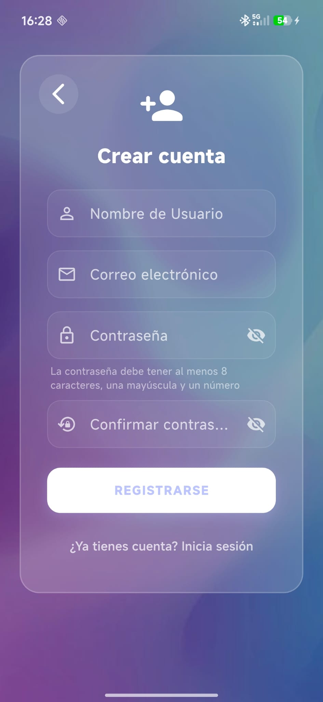

### 2.2 Iniciar sesión

Usa tu correo y contraseña para acceder. Si olvidaste la contraseña, pulsa **¿Olvidaste tu contraseña?** para recibir un enlace de restablecimiento.

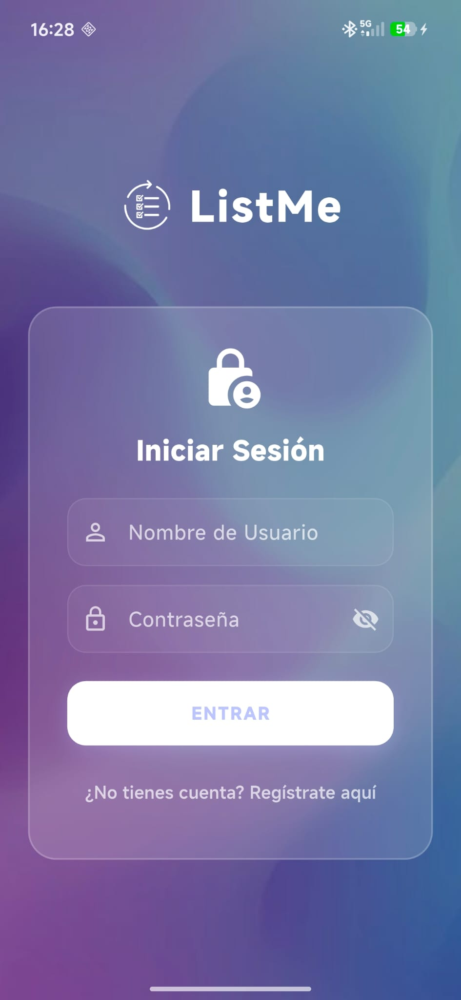

---

## 3. Pantalla principal — Mis listas

Tras iniciar sesión accederás a tu pantalla principal con todas tus listas. Aquí se muestran tanto las listas que has creado como las compartidas contigo por otros usuarios.

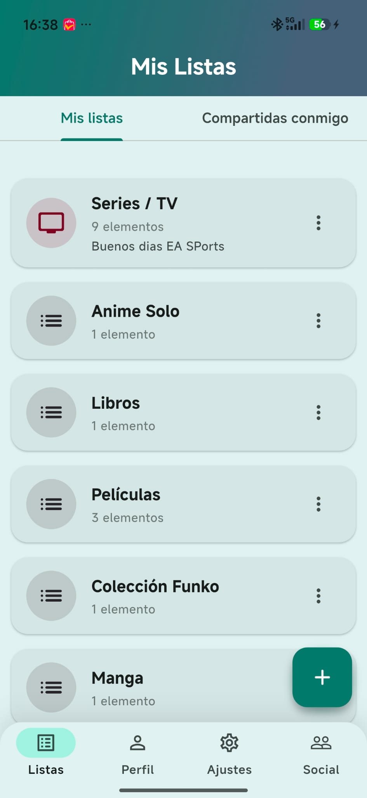

- Pulsa una lista para ver su contenido.
- Pulsa el botón **+** para crear una nueva lista.
- Pulsa el menú de tres puntos (**⋮**) de cualquier lista para ver las opciones de editar o eliminar.

---

## 4. Crear una lista

Pulsa el botón **+** en la pantalla principal. Introduce:

- **Nombre** — título de la lista.
- **Descripción** *(opcional)* — breve descripción.
- **Categoría** — elige entre Películas, Series, Libros, Manga, Anime, Videojuegos u otras.

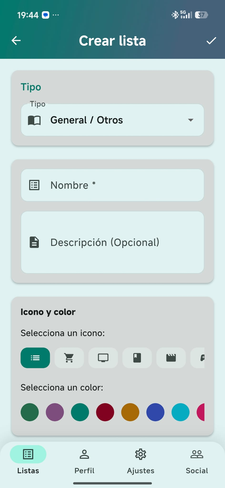

Confirma pulsando **Crear**. La nueva lista aparecerá en tu pantalla principal.

---

## 5. Ver el contenido de una lista

Al entrar en una lista verás la cuadrícula de ítems. En tablet y escritorio puedes cambiar entre vista de cuadrícula y vista de lista con el icono de la barra superior.

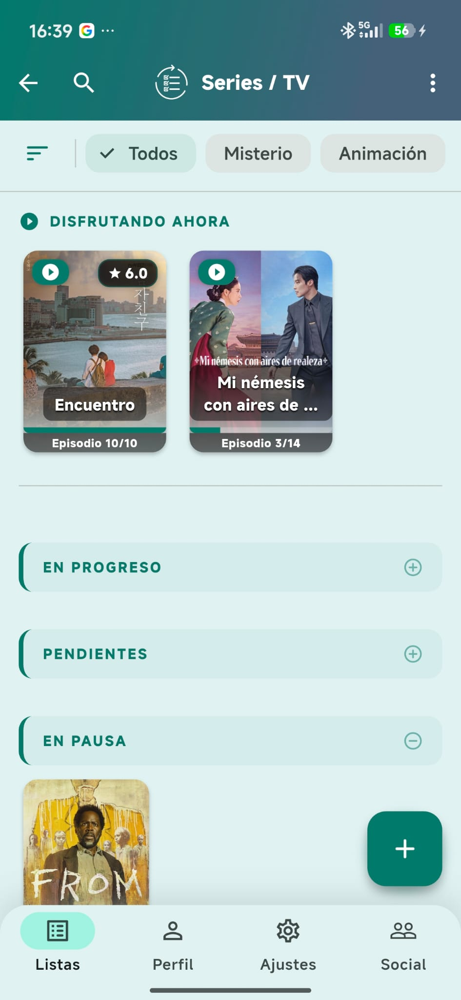

Usa la barra de búsqueda para filtrar por nombre, y los filtros rápidos para acotar por estado u otros atributos.

---

## 6. Añadir un ítem manualmente

Dentro de una lista, pulsa el botón **+** y elige **Añadir manualmente**.

Rellena los campos básicos:

- **Título** *(obligatorio)*
- **Descripción**
- **Imagen** — sube una foto desde la galería o la cámara (en móvil)

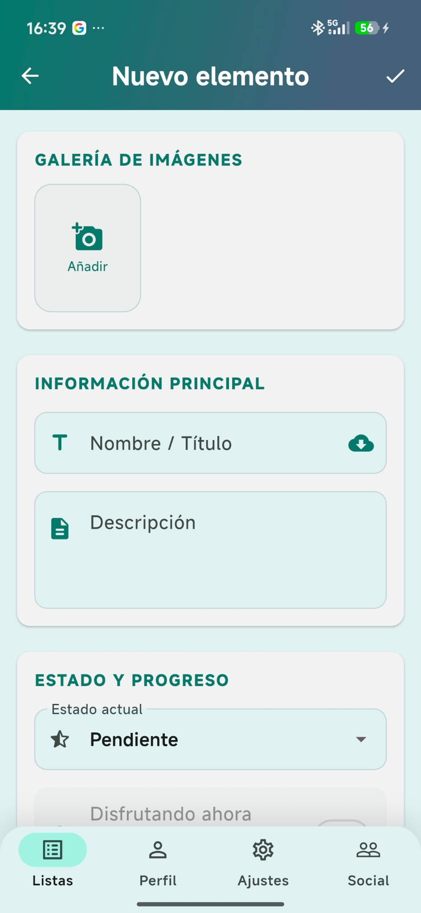

Una vez guardado, el ítem aparecerá en la lista y podrás añadirle atributos adicionales desde su pantalla de detalle.

---

## 7. Importar un ítem desde una API

Pulsa el botón **+** y elige **Buscar e importar**. Escribe el título en la barra de búsqueda y selecciona la fuente:

| Categoría | Fuentes disponibles |
|-----------|-------------------|
| Películas | TMDb, OMDb |
| Series | TMDb, OMDb |
| Libros | Google Books |
| Manga | MAL, MangaDex, Tomos |
| Anime | MAL |
| Videojuegos | *(solo añadir manualmente)* |

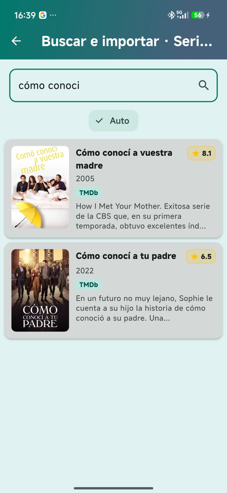

Pulsa sobre el resultado deseado para importarlo con todos sus metadatos (título, sinopsis, portada, año…).

---

## 8. Detalle de un ítem

La pantalla de detalle muestra toda la información del ítem. Desde aquí puedes:

- **Editar** el título, descripción y atributos.
- **Añadir atributos personalizados** (puntuación, estado, fecha de inicio…).
- **Ver y gestionar la galería** de imágenes.

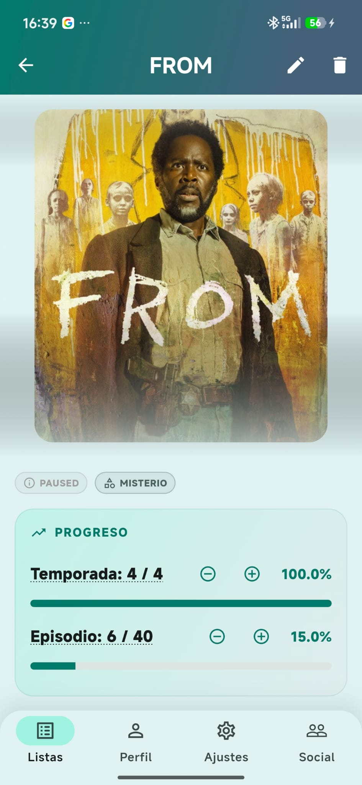

### 8.1 Editar atributos

Pulsa el icono de lápiz junto a cualquier atributo para modificar su valor. Confirma los cambios pulsando el botón de guardar.

---

## 9. Galería de imágenes

En la sección de imágenes del detalle puedes:

- **Subir nuevas imágenes** con el botón **+**.
- **Marcar una imagen como favorita** pulsando la estrella — esa imagen se usará como miniatura en la lista.
- **Ver una imagen a pantalla completa** pulsando sobre ella.

---

## 10. Pantalla social — Amigos y solicitudes

Accede a la pantalla social desde el menú de navegación inferior (icono de personas). Es el punto central para gestionar tus relaciones con otros usuarios de ListMe.

### En móvil — tres pestañas

La pantalla se divide en tres pestañas con contadores de elementos pendientes:

- **Amigos** — lista de amigos confirmados con botón para añadir nuevos.
- **Solicitudes** — solicitudes de amistad pendientes que has recibido.
- **Invitaciones** — invitaciones a listas compartidas que están esperando tu respuesta.

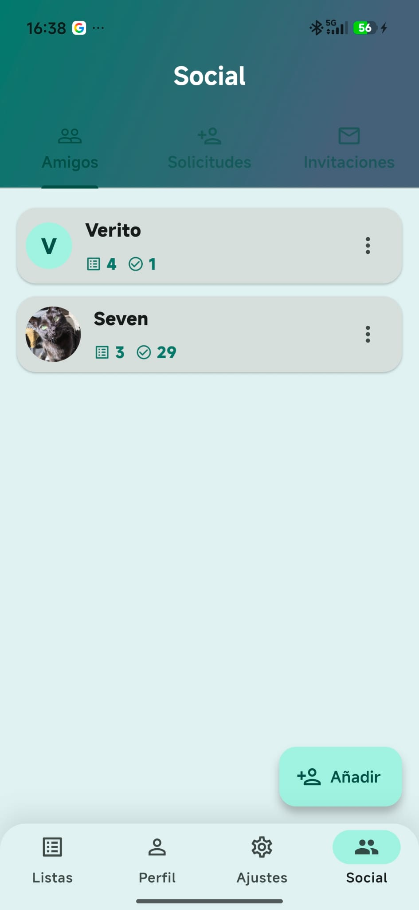

### En web y escritorio — tres columnas

En pantallas anchas la información se muestra simultáneamente en tres columnas: amigos a la izquierda, feed de actividad en el centro (próximamente) y solicitudes e invitaciones a la derecha.

### 10.1 Añadir un amigo

Pulsa el botón **Añadir amigo** (icono de persona con +). Introduce el nombre de usuario exacto del destinatario y pulsa **Enviar**. El otro usuario recibirá tu solicitud en su pestaña de Solicitudes.

### 10.2 Aceptar o rechazar una solicitud

En la pestaña **Solicitudes** verás las peticiones de amistad pendientes. Pulsa el icono de verificación para aceptar o el de cruz para rechazar. Al aceptar, el usuario pasará a tu lista de amigos.

### 10.3 Eliminar un amigo

En la pestaña **Amigos**, mantén pulsado o pulsa el menú de opciones de cualquier amigo para eliminarlo de tu lista.

---

## 11. Compartir una lista con otros usuarios

Entra en una lista y pulsa el icono de personas en la barra superior. Desde aquí puedes:

- **Invitar a un usuario** introduciendo su nombre de usuario y asignándole un rol (editor o visor).
- **Ver los colaboradores** actuales y su rol.
- **Revocar el acceso** a un colaborador existente.

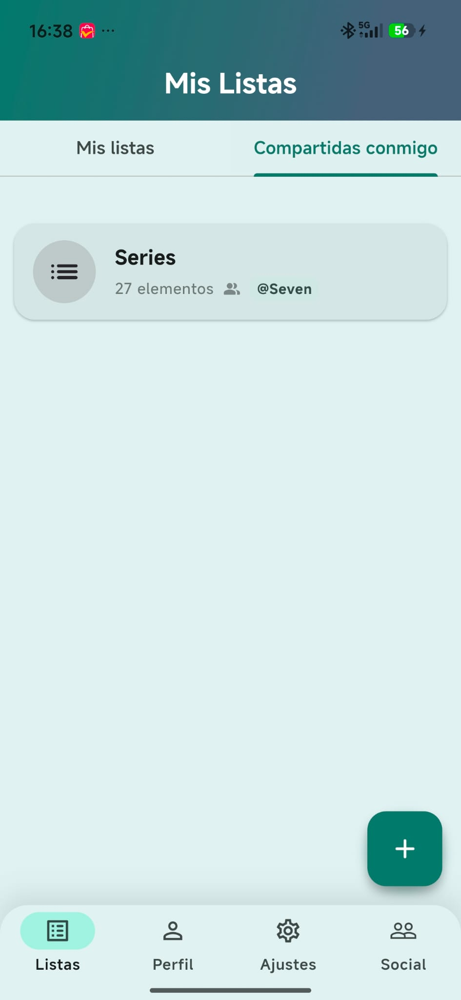

El usuario invitado recibirá la invitación en la pestaña **Invitaciones** de su pantalla social y podrá aceptarla o rechazarla desde allí.

---

## 12. Ajustes

Accede a los ajustes desde el menú lateral o el icono de engranaje. Aquí puedes configurar:

### 12.1 Apariencia

- **Tema** — claro, oscuro o automático (según el sistema).
- **Color de acento** — elige entre varias paletas de color.
- **Tamaño de fuente** — escala el texto a tu gusto.

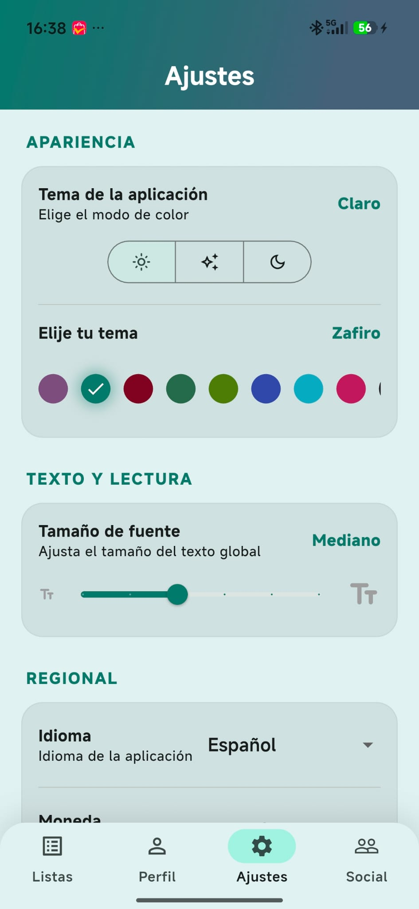

### 12.2 Regional

- **Idioma** — español o inglés.
- **Moneda** — código ISO de la moneda para mostrar precios.

### 12.3 Claves API

Introduce tus propias claves de API para mayor privacidad y límites más altos:

- **TMDb API Key**
- **OMDb API Key**
- **Google Books API Key**

---

## 13. Perfil de usuario

Desde el menú lateral accede a tu perfil para:

- Ver y editar tu **nombre de usuario**.
- Cambiar tu **foto de perfil**.
- **Cerrar sesión**.

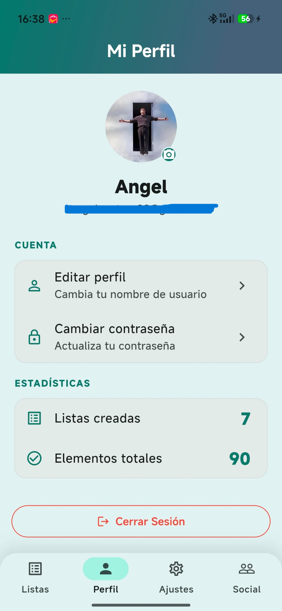

---

*Para soporte o incidencias, contacta con el desarrollador.*
